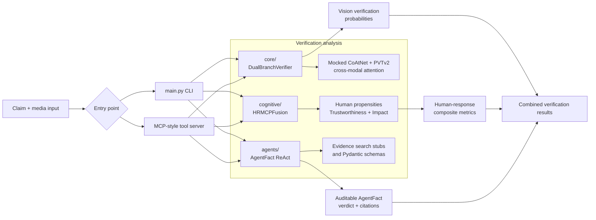

# Multimodal AI Verification System

An end-to-end reference implementation combining:

1. **`core/`** -- a dual-branch PyTorch vision network (mocked CoAtNet +
   PVTv2 backbones, custom GELU/ELU activations, directional cross-modal
   attention) for detecting synthetic/manipulated media.
2. **`cognitive/`** -- an HR-MCP (Human Response - Model Context Protocol)
   fusion network that predicts human-response propensities (perceived
   AI-generation likelihood, belief, dissemination) and derives composite
   Trustworthiness / Impact metrics.
3. **`agents/`** -- an auditable, Pydantic-validated multi-agent
   (`AgentFact`) ReAct orchestrator for evidence-linked fact verification,
   exposed over an async, MCP-style tool server.

## Why everything runs offline

Every neural network component uses architecturally-representative but
compact **mocked backbones** (no pretrained checkpoint downloads) and every
agentic tool call is a clearly-marked, deterministic **stub** by default.
This means:

```bash
pip install -r requirements.txt
python main.py
pytest
```

...both work out of the box, with zero network access, in any Python 3.12
environment. Every place where you would plug in a real backbone,
pretrained weights, or a live search API is marked with a
`TODO-EXTENSION-MARKER` comment explaining exactly what to change and why.

## Directory structure

```
multimodal_verifier/
├── config/
│   └── default_config.yaml     # All hyperparameters, centrally versioned
├── core/
│   ├── activations.py          # CustomGELU, CustomELU (math spelled out)
│   ├── backbones.py            # Mocked CoAtNetBackbone, PVTv2Backbone
│   ├── cross_attention.py      # DirectionalCrossAttention (Q/K/V + residual)
│   └── verifier_model.py       # DualBranchVerifier + metrics
├── cognitive/
│   ├── hr_mcp_fusion.py        # HRMCPFusion (semantics + sentiment + propensity)
│   └── propensity.py           # Composite metrics + categorical classification
├── agents/
│   ├── schemas.py              # Pydantic V2: EvidenceItem, VerifiableFact, ExplainedPrediction
│   ├── agent_fact.py           # AgentFact ReAct orchestrator (3 modes)
│   └── mcp_server.py           # Async MCP-style tool server
├── tests/
│   ├── test_verifier.py
│   └── test_propensity.py
└── main.py                     # CLI pipeline runner (`--serve` for MCP mode)
```

## End-to-end flow

The project combines visual analysis, human-response modeling, and
evidence-linked reasoning into one auditable verification pipeline:



### Diagram box reference

Each box above corresponds to the following implementation surface:

| Diagram box | Relevant implementation |
|---|---|
| **Claim + media input** | [`main.py`](main.py): `build_arg_parser()` accepts `--claim` and `--config`; [`agents/mcp_server.py`](agents/mcp_server.py): `MCPServer.verify_media_claims()` accepts an image shape, claim, and optional `image_ref`, while `get_human_perceptions()` accepts visual and text embeddings. |
| **Entry point** | [`main.py`](main.py): `main()` loads configuration, selects `--serve` or the one-shot pipeline, resolves the device with `resolve_device()`, and seeds PyTorch for reproducible demo output. |
| **main.py CLI** | [`main.py`](main.py): `run_vision_pipeline()`, `run_cognitive_pipeline()`, and `run_agentic_pipeline()` construct the three pipelines and return serializable results. |
| **MCP-style tool server** | [`agents/mcp_server.py`](agents/mcp_server.py): `MCPServer.__init__()` registers the tools; `register_tool()`, `list_tools()`, and `call_tool()` provide discovery and async dispatch; `run_stdio_stub()` supplies the offline transport loop. |
| **core / DualBranchVerifier** | [`core/verifier_model.py`](core/verifier_model.py): `DualBranchVerifier` runs the GELU and ELU branches; `forward()` produces class logits, `fuse()` combines branch features, and `forward_with_features()` exposes intermediate features for inspection. |
| **Mocked CoAtNet + PVTv2 / cross-modal attention** | [`core/backbones.py`](core/backbones.py): `CoAtNetBackbone.forward()` and `PVTv2Backbone.forward()` produce compact offline feature vectors; [`core/cross_attention.py`](core/cross_attention.py): `DirectionalCrossAttention.forward()` provides directional Q/K/V attention with residual normalization. [`core/activations.py`](core/activations.py) supplies `CustomGELU` and `CustomELU`. |
| **cognitive / HRMCPFusion** | [`cognitive/hr_mcp_fusion.py`](cognitive/hr_mcp_fusion.py): `HRMCPFusion.forward()` concatenates visual/text embeddings, applies `_SentimentMLP`, fuses with `LayerNorm`, and runs the three `_PropensityHead` instances into an `HRMCPOutput`. |
| **Human propensities / Trustworthiness + Impact** | [`cognitive/propensity.py`](cognitive/propensity.py): `PropensityClassifier.classify()` connects model output to `classify_propensity()`; `CompositeMetrics`, `TrustLevel`, and `ImpactLevel` hold the scores and labels. |
| **agents / AgentFact ReAct** | [`agents/agent_fact.py`](agents/agent_fact.py): `AgentFact.verify_claim()` runs the Think/Act/Observe loop; `_search_preloaded_evidence()` searches bounded evidence, `_dispatch_action()` enforces `AgentMode`, and the web/reverse-image tool methods are deterministic stubs. `ReActStep` records the trace. |
| **Evidence search stubs and Pydantic schemas** | [`agents/agent_fact.py`](agents/agent_fact.py) contains `_web_search_tool()` and `_reverse_image_search_tool()`; [`agents/schemas.py`](agents/schemas.py) defines `EvidenceItem`, `VerifiableFact`, `ExplainedPrediction`, and `VerdictLabel`, including grounded-citation validation. |
| **Vision verification probabilities** | [`main.py`](main.py): `run_vision_pipeline()` applies `torch.softmax()` to `DualBranchVerifier` logits; [`agents/mcp_server.py`](agents/mcp_server.py): `verify_media_claims()` returns real/synthetic probabilities for async callers. Offline evaluation metrics are calculated by `compute_verifier_metrics()` in [`core/verifier_model.py`](core/verifier_model.py). |
| **Human-response composite metrics** | [`main.py`](main.py): `run_cognitive_pipeline()` calls `PropensityClassifier`; [`agents/mcp_server.py`](agents/mcp_server.py): `get_human_perceptions()` performs the same operation asynchronously and returns `CompositeMetrics.as_dict()`. |
| **Auditable AgentFact verdict + citations** | [`agents/agent_fact.py`](agents/agent_fact.py): `verify_claim()` builds the verdict and confidence heuristic; [`agents/schemas.py`](agents/schemas.py): `ExplainedPrediction` validates the final verdict, evidence pool, reasons, and citation grounding. |
| **Combined verification results** | [`main.py`](main.py): `main()` prints the three JSON result blocks; [`agents/mcp_server.py`](agents/mcp_server.py): `call_tool()` wraps async tool results in an MCP-style `content` response with an `isError` flag. |

## Running the demo pipeline

```bash
python main.py --claim "This photo was taken at the summit yesterday."
```

Prints three JSON blocks: vision-verification probabilities, human-response
composite metrics, and an auditable AgentFact verdict.

## Running the MCP tool server

```bash
python main.py --serve
```

Registers `verify_media_claims` and `get_human_perceptions` as async tools
and idles, ready for a (stub) transport loop. See the
`TODO-EXTENSION-MARKER [REAL_MCP_TRANSPORT]` in `agents/mcp_server.py` to
wire this to a real MCP SDK transport.

## Running tests

```bash
pytest
```

Covers activation-function numerical correctness, cross-attention shape
contracts and residual-connection behaviour, dual-branch fusion strategies,
classification metrics (accuracy/F1/ROC-AUC), HR-MCP fusion shape
contracts, composite-metric formulas, and Pydantic schema validation
(including the "no hallucinated citations" guarantee).

## Extension points

Search for `TODO-EXTENSION-MARKER` across the codebase for every point
where this reference implementation intentionally stubs out something a
production deployment would replace:

| Marker | Location | What to plug in |
|---|---|---|
| `REAL_BACKBONE_WEIGHTS` | `core/backbones.py` | Pretrained `timm` CoAtNet/PVTv2 |
| `BACKBONE_TOPOLOGY` | `core/verifier_model.py` | Parallel (not series) backbone wiring |
| `SKIP_CONNECTION_TOPOLOGY` | `core/verifier_model.py` | Feed intermediate spatial maps, not pooled vectors |
| `SERPER_INTEGRATION` | `agents/agent_fact.py` | Real Serper.dev web search |
| `GVISION_INTEGRATION` | `agents/agent_fact.py` | Real Google Vision reverse-image search |
| `CONFIDENCE_MODEL` | `agents/agent_fact.py` | Learned confidence calibration |
| `REAL_MCP_TRANSPORT` | `agents/mcp_server.py` | Official `mcp` SDK stdio/SSE transport |
| `IMAGE_DECODING` | `agents/mcp_server.py` | Real image byte decoding |
| `SEARCH_API_KEYS` | `config/default_config.yaml` | Environment-variable-backed API keys |
| `REAL_INPUTS_AND_WEIGHTS` | `main.py` | Real images/embeddings + trained checkpoints |
